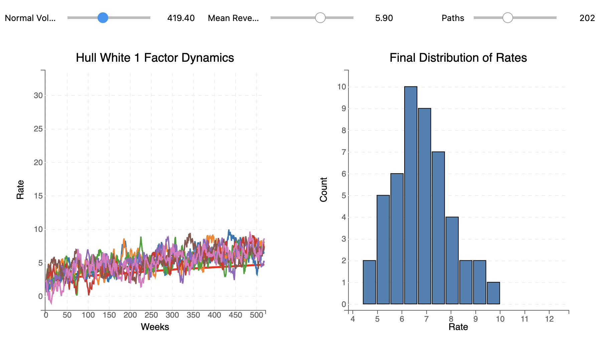

# Hull-White 1/2 Factor Dynamics

This app is designed to illustrate the dynamics of the Hull-White model for interest rates.
It was developed many years ago for teaching purposes, rather than pricing or trading (and should never be used for such).

To use it first install the `requirements.txt`, then:

1) Make sure you're running this in a Jupyter kernel since the app is interactive
2) Open up the `example.ipynb`
3) Enter your zero coupon rate assumptions, these are aribtrary starting values
4) Choose your parameters via the slider bars and the chart will start populating

You can see how the mean reversion affects how far the simulation paths are spread around the forward curve. The higher the mean reversion speed and the lower the volatility, the closer they converge to the forward curve. In the limit they are identical.

The 2-factor specification is practically identical to the one factor model except that an additional term controls the mean reversion speed of the long end. Now,
instead of having one mean reversion speed you will have two, one for the short rate and another for the long end. 

These models can be used to price structured notes such as collared floaters or more exotic options such as range accruals, CMS spreads and accumulators. In a modern
setting however a Libor Market Model is preferred since it can capture implied volatility (e.g. skew) dynamics much better.